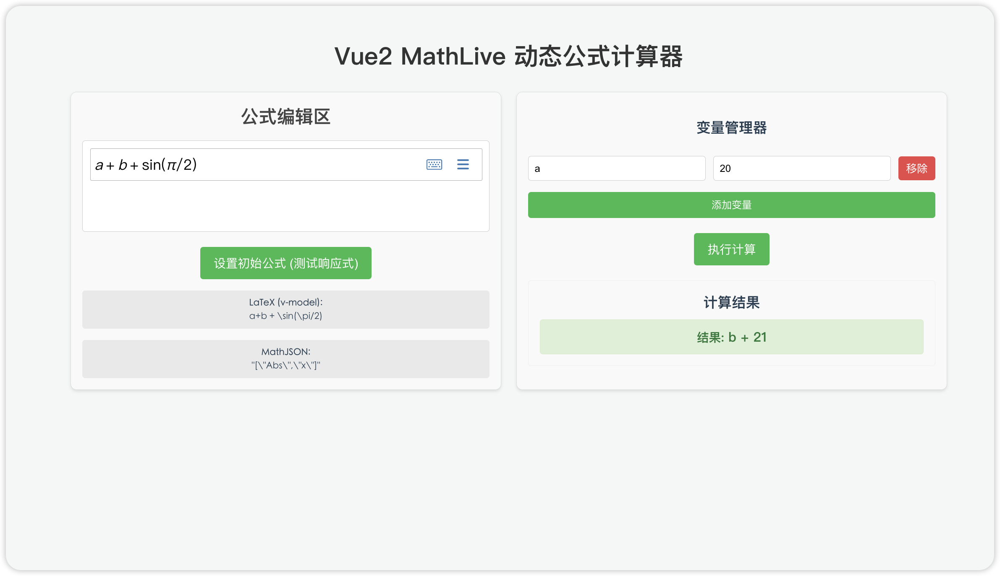

# Vue2 MathLive 动态公式计算器

## 项目介绍

Vue2 MathLive 动态公式计算器是一个基于 Vue2 和 MathLive 库的动态公式计算器应用程序。它允许用户输入和编辑数学公式，并实时显示公式的解析结果。

## 功能特性

- 支持常见的数学公式输入和编辑。
- 实时显示公式的解析结果。
- 支持公式的复制、粘贴和删除操作。
- 支持公式的撤销和重做操作。
- 支持公式的保存和加载操作。
- 支持公式的导出和导入操作。
- 支持公式的打印操作。
- 支持公式的导出为图片操作。
- 支持公式的导出为 LaTeX 操作。
- 支持公式的导出为 MathML 操作。
- 支持公式的导出为 MathJSON 操作。
- 支持公式的导出为 MathJS 操作。
- 支持公式的导出为 MathTeX 操作。

## 技术栈

- Vue2
- MathLive
- Element UI

## 安装和使用

1. 克隆或下载项目代码。
2. 安装依赖：npm install
3. 启动开发服务器：npm run serve

